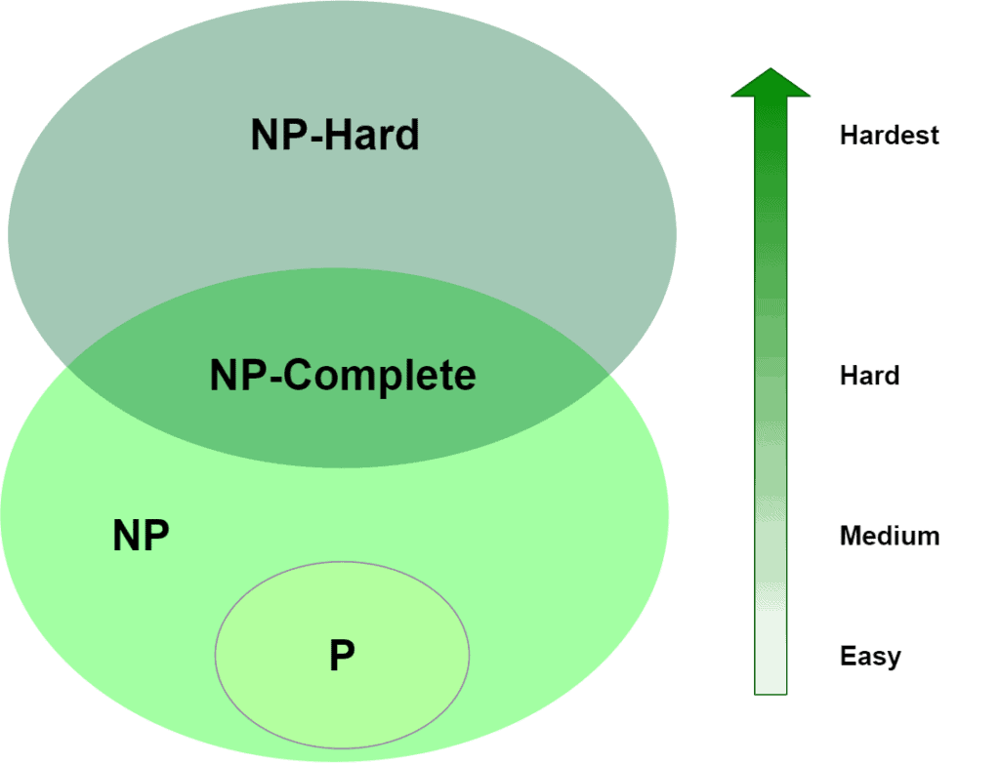
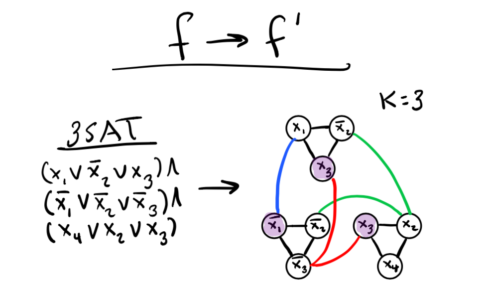

# WTF zk 教程第 45 讲：NP完全性

在上一讲中，我们介绍了P类和NP类。这一讲，我们将深入探讨NP完全性的概念，这是复杂性理论中的一个核心主题，也是理解许多密码学和零知识证明系统的基础。

## 1. 归约

在讨论NP完全性之前，我们需要先理解归约（Reduction）的概念。归约是将某个计算问题变换为另一个问题的过程，它允许我们比较问题的相对难度。如果问题A可以转化为问题B，那么我们就可以用B的答案去解决A，也就是说B至少和A一样难。换句话说，如果我们能解决问题B，就能解决问题A。

### 1.1 映射归约

映射归约（Mapping Reduction）是最基本的归约类型。

定义：给定两个语言 $L_1$ 和 $L_2$，如果存在一个可计算函数 $f$，对于所有输入 $x$，有 $x \in L_1$ 当且仅当 $f(x) \in L_2$，则我们说 $L_1$ 可归约到 $L_2$，记作 $L_1 \leq_m L_2$。

映射归约展示了如何利用一个映射将一个问题转化为另一个问题。

### 1.2 多项式时间归约

多项式时间归约（Polynomial-time Reduction）是映射归约的一个更强版本，它要求归约过程必须在多项式时间内完成。

定义：如果存在一个多项式时间算法 $f$，对于任意输入 $x$，有 $x \in L_1$ 当且仅当 $f(x) \in L_2$，则我们说 $L_1$ 可多项式时间归约到 $L_2$，记作 $L_1 \leq_p L_2$。

### 1.3 归约示例

我们以离散对数问题（DLP）和计算Diffie-Hellman问题（CDH）为例，其中：

1. DLP：给定循环群 $G$、生成元 $g$ 和元素 $y \in G$，找到整数 $x$ 使得 $g^x = y$。

2. CDH：给定循环群 $G$、生成元 $g$ 以及 $g^a$ 和 $g^b$（其中 $a$ 和 $b$ 未知），计算 $g^{ab}$。

这两个密码学常用难题均为NP类，没有多项式时间的有效解法。那它们之间是否存在归约关系呢？

答案是有的，如果能解决DLP，就能轻松的解决CDH问题：给定 $g^a$ 和 $g^b$，先用DLP求解 $a$，然后计算 $(g^b)^a = g^{ab}$。因此，我们可以说DLP至少与CDH一样难。由于归约算法是多项式时间的，这个关系可以表示为：

$$\text{DLP} \geq_p \text{CDH}$$

## 2. NP完全性

NP类包含非常多的算法，那么人们如何证明P = NP呢？1970年左右，研究者Cook和Levin发现NP中某些问题的复杂性可以和整个类的复杂性产生关联：如果这些问题中的任何一个多项式时间算法，那么所有NP问题都是多项式时间可解的，即P = NP。这类问题被称为NP完全问题（NP-complete），是NP类中最难的问题。

### 2.1 NP完全性的形式化定义

一个语言L是NP完全的，如果：

1. $L \in \text{NP}$
2. 对于每个 $L' \in \text{NP}$，有 $L' \leq_p L$

也就是说，所有NP问题都可以在多项式时间归约到NP完全问题。因此，如果找到任何一个NP完全问题的多项式时间算法，那么所有NP问题都可以在多项式时间内解决(P = NP)。

## 3. SAT问题

SAT（布尔可满足性问题）是第一个被证明为NP完全的问题，在复杂性理论和实际应用中都有重要地位。

我们先复习一下**布尔变量**，**布尔运算**和**布尔公式**。

**布尔变量**指取值为 `TRUE` 或 `FALSE` 的变量，通常我们用 1 表示 `TRUE`，用 0 表示 `FALSE`。

**布尔运算**包含AND，OR，NOT（与、或、非运算），分别用符号 $\wedge$, $\vee$, $\neg$ 表示。为了方便，我们用 $\bar{x}$ 代替 $\neg{x}$。规则如下：

- $0 \wedge 0 = 0$
- $0 \wedge 1 = 0$
- $1 \wedge 0 = 0$
- $1 \wedge 1 = 1$
- $0 \vee 0 = 0$
- $0 \vee 1 = 1$
- $1 \vee 0 = 1$
- $1 \vee 1 = 1$
- $\bar{0} = 1$
- $\bar{1} = 0$

**布尔公式**是包含布尔变量和运算的表达式，例如 

$$\phi = (x_1 \vee \bar{x_2}) \wedge (\bar{x_1} \vee x_3) \wedge (x_2 \vee \bar{x_3})$$

如果存在变量 $x_1, x_2, ..., x_n$ 的取值使得布尔公式的值为1，则称该布尔公式是可满足的（satisfiable）。

### 3.1 定义

SAT问题：给定一个布尔公式 $\phi$，判断是否存在一组变量赋值使得 $\phi$ 为真。

对于 

$$\phi = (x_1 \vee \bar{x_2}) \wedge (\bar{x_1} \vee x_3) \wedge (x_2 \vee \bar{x_3})$$

赋值 $x_1=1$，$x_2=1$，$x_3=1$ 使得公式 $\phi$，因此该布尔公式是可满足的。

## 3.2 Cook-Levin定理

Cook-Levin定理是复杂性理论中的一个里程碑，它证明了SAT问题不仅属于NP，而且是NP完全的，即每个NP语言 $L$ 都可以多项式时间归约到SAT问题。

1. 它建立了第一个NP完全性问题，即SAT。
2. 它建立了一个模板，可以用来证明其他问题的NP完全性。

Cook-Levin定理的证明思路是将任意NP问题的验证过程编码为一个布尔公式，证明过程超出本教程范围，请大家自行查阅。

## 4. 总结

这一讲，我们介绍了归约和NP完全性。归约可以让我们比较不同问题的相对难度。NP完全性是NP中最难的一类问题，所有NP问题都可以归约到它们。SAT问题是第一个被证明为NP完全的问题。

