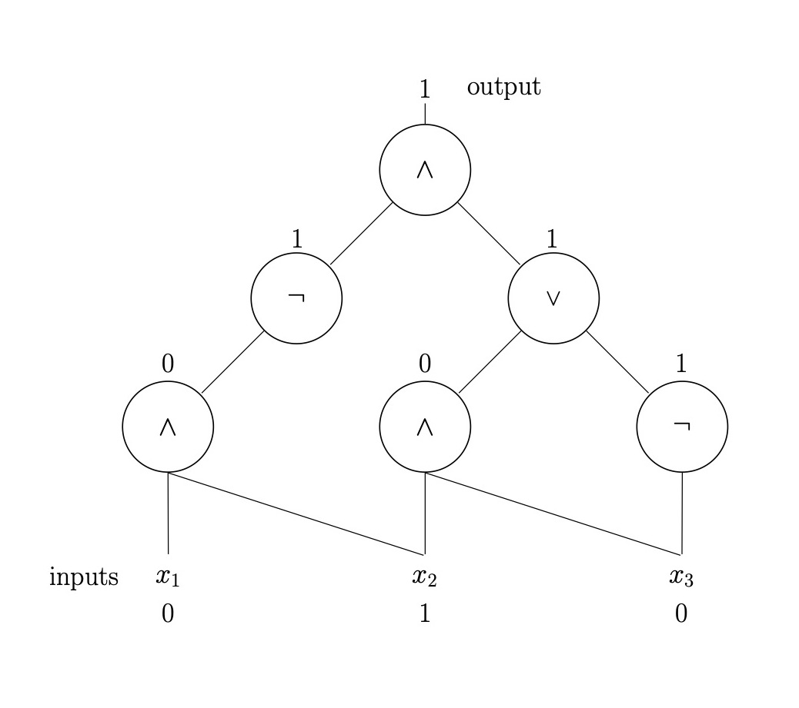
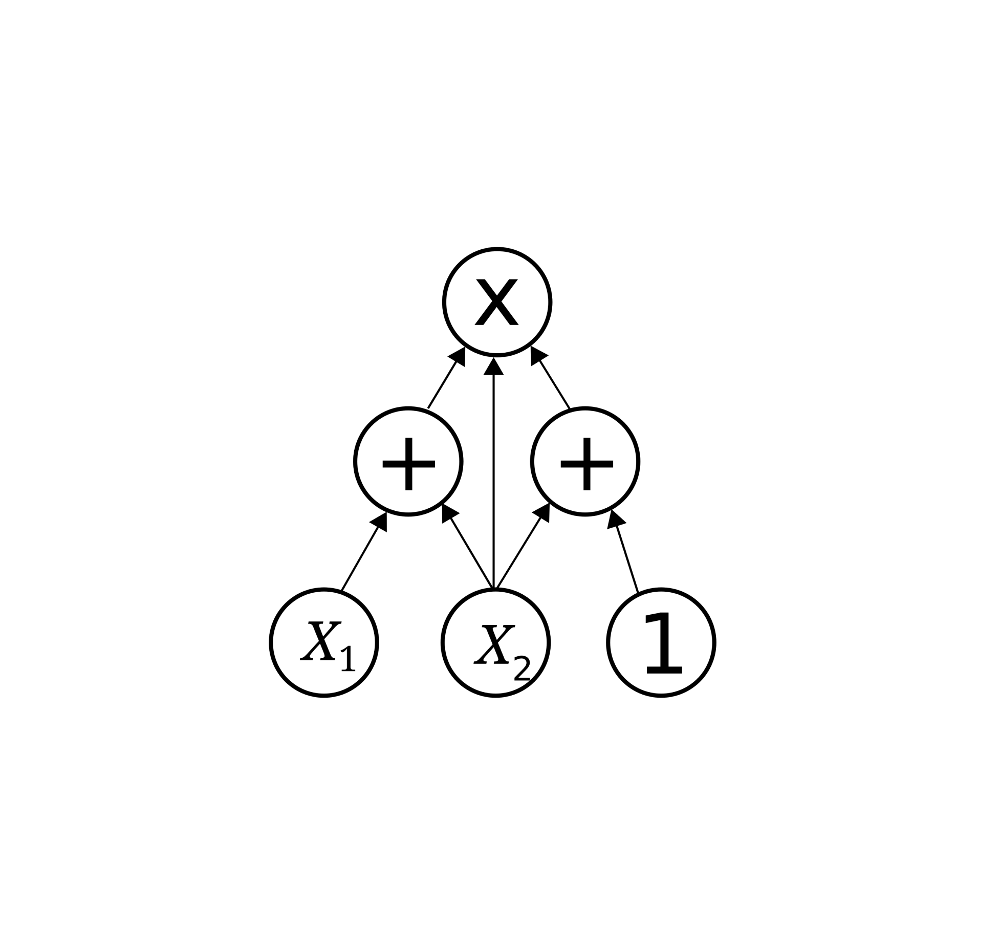

# WTF zk 教程第 46 讲：电路复杂度

这一讲，我们将介绍电路复杂度，着重介绍布尔电路和算术电路的概念，它们对理解零知识证明系统很重要。

## 1. 布尔电路

布尔电路不同于我们在中学物理学习的电路，是由逻辑门（AND、OR、NOT）和连线组成的有向无环图（DAG），用于计算布尔函数。

### 1.1 定义

布尔电路 $C$ 是一个有向无环图，其中：
- 输入节点：代表输入变量。
- 内部节点：代表逻辑门，如AND、OR、NOT，分别用符号 $\wedge$, $\vee$, $\neg$ 表示。
- 输出节点：代表电路的输出。

举个例子，下面的布尔电路有3个输入节点 $(x_1, x_2, x_3)$，计算的布尔函数为：

$$\phi = \neg{(x_1 \wedge x_2)} \wedge ((x_2 \wedge x_3) \vee \bar{x_3})$$

当输入为 $(0, 1, 0)$ 时，布尔电路的输出为 $1$。



### 1.2 电路大小和深度

- **电路大小（Size）**：电路中逻辑门的总数。上面例子中的电路大小为 6。
- **电路深度（Depth）**：从输入到输出的最长路径长度。上面例子中的电路深度为 3。

### 1.3 Python代码示例

下面，我们用python构建了例子中的布尔电路：

```python
class Gate:
    def __init__(self, gate_type):
        self.type = gate_type
        self.inputs = []

    def compute(self):
        if self.type == 'AND':
            return all(self.inputs)
        elif self.type == 'OR':
            return any(self.inputs)
        elif self.type == 'NOT':
            return not self.inputs[0]

class BooleanCircuit:
    def __init__(self):
        self.gates = []
        self.output_gate = None

    def add_gate(self, gate):
        self.gates.append(gate)

    def set_output(self, gate):
        self.output_gate = gate

    def evaluate(self, inputs):
        for gate in self.gates:
            gate.inputs = [inputs[i] if isinstance(i, int) else i.compute() for i in gate.inputs]
        return self.output_gate.compute()

# 示例：构建 (NOT (x1 AND x2)) AND ((x2 AND x3) OR (NOT x3)) 的电路
circuit = BooleanCircuit()
and0 = Gate('AND')
and1 = Gate('AND')
and2 = Gate('AND')
not0 = Gate('NOT')
not1 = Gate('NOT')
or0 = Gate('OR')

and0.inputs = [0, 1]  # x1 AND x2
and1.inputs = [1, 2]     # NOT x3
not0.inputs = [2]
not1.inputs = [and0]
or0.inputs = [and1, not0]
and2.inputs = [not1, or0]

circuit.add_gate(and0)
circuit.add_gate(and1)
circuit.add_gate(not0)
circuit.add_gate(not1)
circuit.add_gate(or0)
circuit.add_gate(and2)

circuit.set_output(and2)

# 评估电路
print(circuit.evaluate([False, True, False]))  
# 输出: 
# True
```

## 1.4 Circuit-SAT 问题

Circuit-SAT（电路可满足性问题）是布尔可满足性问题（SAT）的电路版本。

由于任意布尔函数都可以由布尔电路表示，因此我们可以将SAT转换为Circuit-SAT问题，即给定一个布尔电路 $C$，判断是否存在一组输入使得 $C$ 的输出为1。

由于SAT是NP完全问题，因此Circuit-SAT也是NP完全问题，这也就意味着任何NP问题都可以转换为Circuit-SAT。这体现了布尔电路的通用性。

## 2. 电路复杂度

电路复杂度研究计算问题需要的最小电路大小和深度。

### 2.1 常用的电路复杂度类

1. **$\text{SIZE}(t(n))$**：可以用大小为 $O(t(n))$ 的电路族计算的函数类。时间复杂度为 $t(n)$ 的图灵机可以模拟为大小为 $O(t^2(n))$ 的电路。
2. **$\text{DEPTH}(d(n))$**：可以用深度为 $O(d(n))$ 的电路族计算的函数类。
3. **P/poly**：可以用多项式大小的电路族计算的函数类。包含所有在多项式时间内可决定的语言，即 $P \subseteq P/\text{poly}$，但也包含一些不可判定的语言。

## 3. 算术电路

算术电路也是一种计算模型，用于计算多项式。与布尔电路不同，算术电路的每个节点表示一个基本的算术运算，比如加法或乘法，而不是布尔运算。电路的输入是常量或变量，输出是多项式的结果。

### 3.1 定义

算术电路 $C$ 是一个有向无环图，其中：
- 输入节点：代表输入变量或常量，一般属于有限域。
- 内部节点：代表加法（+）、乘法（*）、或其他算术运算。
- 输出节点：代表电路的输出，即计算的多项式结果。

举个例子，下面的算术电路有3个输入节点 $(x_1, x_2, 1)$（其中 1 为常数），计算的多项式为：

$$\phi = (x_1 + x_2) \times x_2 \times (x_2 + 1)$$

假设 $x_1, x_2 \in \mathbb{F}_7$ 当输入为 $(1, 2)$ 时，算术电路的输出为 $4$。



### 3.2 电路大小和深度

- **电路大小（Size）**：电路中逻辑门的总数。上面例子中的电路大小为 3。
- **电路深度（Depth）**：从输入到输出的最长路径长度。上面例子中的电路深度为 2。

### 3.3 Circuit-SAT 问题的算术化

我们可以将 Circuit-SAT 问题转化为算术电路，具体方法是将每个布尔电路转换为算术电路：
 
1. NOT 门： $\neg x = 1 - x$
2. AND 门： $x \wedge y = x \times y$
3. OR 门： $x \vee y = 1 - (1 - x)(1 - y)$

转换后，布尔函数 $\phi(x_1, x_2, ..., x_n)$ 可以表示为算术电路 $p(x_1, x_2, ..., x_n)$，其中每个布尔运算都被替换为相应的算术运算。

因此，由于 circuit SAT 是 NP 完全问题，因此算术电路 SAT 也是 NP 完全问题。也就是说，每一个 NP 问题都可以算术电路化。

### 3.4 相关复杂性类
算术电路复杂度中有两类重要的复杂性类：

- **VP类**：类比于P类，包含那些可以在多项式大小的算术电路中计算的问题，比如计算行列式的值。
- **VNP类**：类比于NP类，包含那些虽然可以在多项式时间内验证结果是否正确，但可能无法在多项式大小的算术电路中有效计算的问题。

### 3.5 零知识证明中的应用

算术电路在零知识证明系统扮演着重要角色，特别是在zk-SNARK（零知识简洁非交互式知识论证）中。主要有以下几点原因：

1. **通用性**：算术电路几乎可以表示任意的计算问题。

2. **兼容性**：算术电路在有限域上工作，这与许多密码学原语（如椭圆曲线密码）天然兼容。

3. **高效性**：算术电路有助于生成更小、验证更快的证明，对于zk-SNARKs的"简洁"（Succinct）特性至关重要。

我们会在之后的章节中更详细的介绍zk-SNARK用到的算术电路相关概念，包括 R1CS 和 QAP。

## 4. 总结

这一讲，我们介绍了电路复杂度，着重介绍了布尔电路和算术电路。与物理学中的电路不同，这里的电路是由布尔运算/算术运算构成的有向无环图，用于计算布尔表达式或多项式。其中，算术电路几乎可以表示任意的计算问题，广泛用于零知识证明系统。