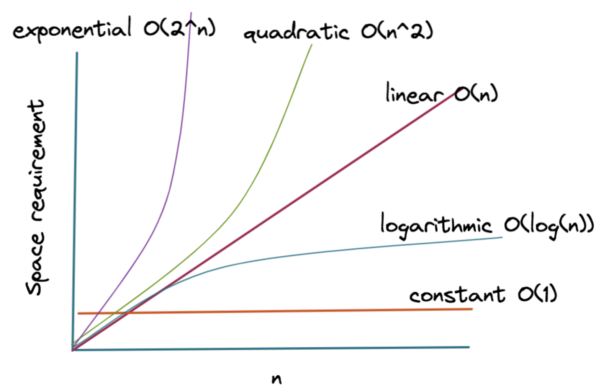
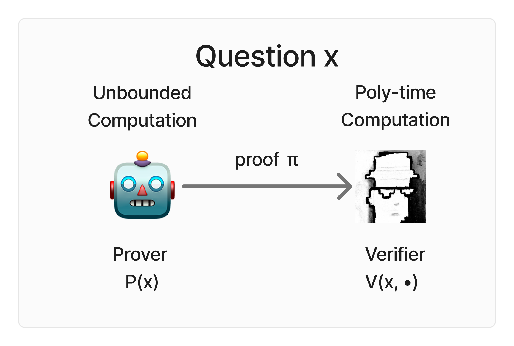
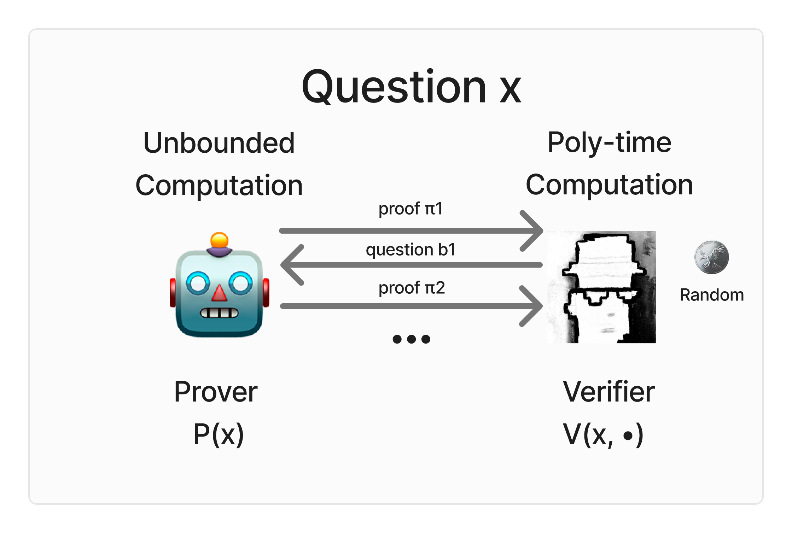
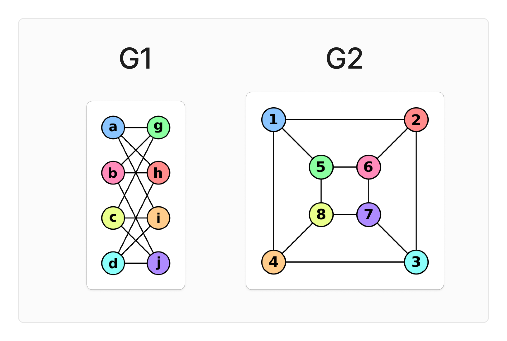
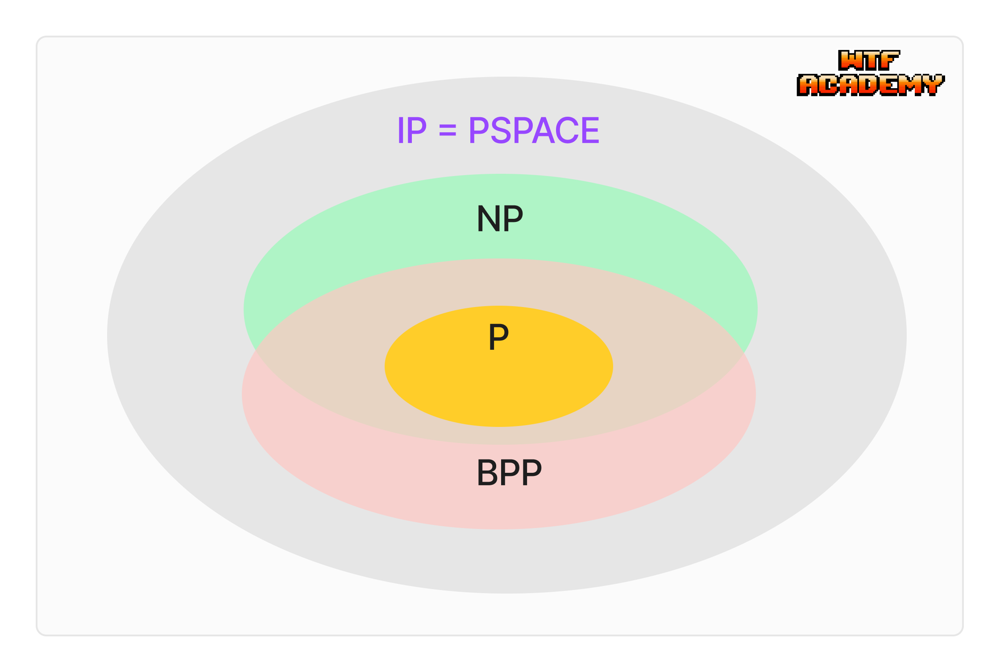

# WTF zk 教程第 48 讲：交互式证明系统

这一讲，我们将介绍交互式证明系统，探讨证明系统、空间复杂性、IP 复杂性类等概念。最早的零知识证明系统是交互式证明系统，理解这些概念非常重要。

## 1. 空间复杂性

在讨论交互式证明系统之前，我们需要简单了解空间复杂性和 PSPACE 复杂类，这对于之后理解 IP = PSPACE 很有帮助。

### 1.1 空间复杂性

时间复杂性类似，空间复杂性关注的是算法在解决问题时所需的存储空间。我们通常用大O表示法来描述空间复杂性：

- 如果一个算法的空间复杂性是 $O(n)$，意味着它所需的存储空间随输入大小 $n$ 线性增长。
- 对于一些问题，我们可能更关心空间使用而不是时间，特别是在存储资源有限的情况下。

### 1.2 PSPACE 复杂类

PSPACE（Polynomial Space）包含了所有可以在多项式空间内解决的问题。PSPACE 包含了许多复杂性类，包括 P、NP、BPP 等。

**形式化定义**：一个语言 $L$ 属于 PSPACE，当且仅当存在一个确定性图灵机 $M$，对于每一个输入 $x$，能够在多项式空间内决定 $x$ 是否属于 $L$。

换句话说，即使算法可能需要指数级的时间来完成，但如果它所需要的空间是多项式级的，那么它仍属于 PSPACE 类。实际上，所有 NP 问题都属于 PSPACE 类，因为解决 NP 完全问题 SAT 仅需要多项式空间。

## 2. 证明系统

**证明系统**（Proof System）是计算复杂性理论和密码学中的一种基本概念，用于形式化地描述如何证明一个命题的正确性。它涉及两个参与者：**证明者**（Prover）和**验证者**（Verifier）。证明系统的目标是让证明者说服验证者某个命题是正确的，但验证者不用进行完整的计算。

- **证明者 $P$**：知道某个命题 $x$ 属于某个语言 $L$ 的证明，试图说服验证者 $V$ 这个命题是正确的。证明者可以拥有无限的计算能力。
- **验证者 $V$**：通过与证明者 $P$ 的互动，决定是否接受命题 $x$ 属于 $L$ 的结论。验证者的计算资源通常是受限的，比如多项式时间的图灵机。

### 2.1 完备性与可靠性

证明系统的两个核心属性是**完备性**（Completeness）和**可靠性**（Soundness）。

- **完备性**：如果 $x \in L$（命题为真），则验证者将会接受证明者提供的证明，即“真的假不了”。
- **可靠性**：如果 $x \notin L$（命题为假），无论证明者如何尝试欺骗，验证者都会拒绝证明，即“假的真不了”。

### 2.2 NP 证明系统

我们可以将 NP 类看作一种证明系统，过去2000年的数学证明都遵循这类范式：一个数学家提出一个定理，然后提供一个证明，接下来由其他数学家（相当于验证者）在有限的步骤内验证这个证明的正确性。

在 NP 证明系统中，验证者（Verifier）是一个多项式时间的确定性图灵机，证明者（Prover）的计算资源没有限制（就像历史上有名的数学家一样）但可能不诚实。对于给定的问题实例 $x$，证明者提供一个证明（或证据）$\pi $ 并发送给验证者。验证者在收到证明后，对它进行多项式时间的计算来验证 $V(x, \pi)$，决定是否接受证明。

SAT 问题是一个典型的 NP 证明系统的例子，其中问题实例 $x$ 是给定的布尔公式 $\phi(x_1, x_2, \ldots, x_n)$，证明者提供的证明是一组使得布尔公式为1的变量赋值 $(x_1, x_2, \ldots, x_n)$。验证者收到证明后，只需验证这组赋值是否使得布尔公式为1，即可判断证明是否正确，而验证它只需要多项式时间。

## 3. 交互式证明系统

交互式证明系统（Interactive Proof System）是1980年后才被提出的证明系统，加入了两个创新：

1. **随机性**：验证者 $V$ 为多项式概率图灵机，可以使用随机数（掷硬币）来增强验证过程的效率和安全性。
2. **交互性**：验证者和证明者可以进行多轮交互，以提高验证的可靠性。

由于验证者 $V$ 为概率图灵机，因此证明的完备性和可靠性需要重新定义：

- **完备性**：如果 $x \in L$，则每轮交互验证者 $V$ 将会以大于 $\frac{1}{2}$ 的概率接受证明者提供的证明，即概率版“真的假不了”。
- **可靠性**：如果 $x \notin L$，则验证者 $V$ 将会以小于 $\frac{1}{2}$ 的概率接受证明者提供的证明，即概率版“假的真不了”。

>  实际上，只需要完备性和健壮性概率之间的差距大于 $\frac{1}{\text{poly}(n)}$，我们就可以通过**放大引理**，使得验证者 $V$ 最终以接近1的概率接受证明者提供的证明。

### 3.1 图非同构问题

下面我们通过一个经典的例子来理解交互式证明：图非同构问题（Graph Non-isomorphism，GNI）。图非同构问题描述如下：给定两个图 $G_1$ 和 $G_2$，判断它们是否不同构。两个图同构意味着存在一种方式将一个图的顶点重新标记，使其与另一个图完全相同。证明两个图同构很简单，只需将 $G_1$ 的顶点重新标记，使其与 $G_2$ 完全相同即可；但是判断两个图是否不同构则困难得多，需要遍历所有可能的顶点重新标记方式，这需要指数级的时间。目前还没找到多项式时间算法来验证 GNI，所以它不属于 NP。但是使用交互式证明系统，我们可以高效地判断两个图是否不同构，证明过程如下：

1. 验证者随机选择 $G_1$ 或 $G_2$ 中的一个图，将其顶点随机重新标记得到图 $H$，并将 $H$ 发送给证明者。

2. 证明者（计算资源无限制）需要计算 $H$ 是由 $G_1$ 还是 $G_2$ 重新标记得到的。

3. 如果图确实不同构，证明者总能正确回答，因为他能计算出 $H$ 源自哪个图。

4. 如果图是同构的，证明者只能随机猜测，正确率为 50%。

5. 重复这个过程多次，如果证明者每次都答对，验证者就会相信两个图确实不同构。

这个例子展示了交互式证明系统的核心特征：随机性和多轮交互提高了验证的可靠性，同时保持了验证过程的效率，使得验证者可以在不直接解决问题的情况下，以很高的概率接受或拒绝证明者的证明。

## 4. IP 复杂性类

现在，让我们来介绍 IP（Interactive Proof）复杂性类。IP 是一个包含了所有可以通过交互式证明系统在多项式时间内验证的问题的复杂性类。

### 4.1 定义

语言 $L$ 属于 $\text{IP}$，如果存在一个交互式证明系统 $(P, V)$，其中 $V$ 是一个概率多项式时间图灵机，满足以下条件：

1. 完备性：对于所有 $x \in L$，$\text{Pr}[(P, V)(x) = \text{accept}] ≥ \frac{2}{3}$
2. 可靠性：对于所有 $x \notin L$ 和所有证明者 $P*$，$\text{Pr}[(P*, V)(x) = \text{accept}] ≤ \frac{1}{3}$

这里，$(P, V)(x)$ 表示 $P$ 和 $V$ 在输入 $x$ 上的交互结果。

$\text{IP}$ 类与我们之前学习的 $\text{BPP}$ 类有密切关系。事实上，$\text{BPP} \subseteq \text{IP}$，因为任何 $\text{BPP}$ 问题都可以通过一个简单的交互式证明系统来验证，其中证明者只需发送空消息，验证者自己运行 $\text{BPP}$ 算法即可。

### 4.2 IP = PSPACE

当 $\text{IP}$ 在1985年刚被提出时，人们认为它可能和 $\text{NP}$ 是等价的，但后来大家发现它比 $\text{NP}$ 大得多。其中一个重要的结果是 $\text{IP} = \text{PSPACE}$，即任何可以在多项式空间内解决的问题都有一个交互式证明系统。这个结果大大扩展了我们对可以高效验证的问题类型的理解。通过引入交互和概率，我们可以在多项式时间内验证一些看似需要指数时间才能验证的问题。

## 5. 总结

这一讲，我们介绍了交互式证明系统，包括交互式证明系统的定义、完备性和可靠性、IP 复杂性类等概念。交互式证明系统和零知识证明是在同一篇论文提出的，理解它对我们理解零知识证明非常重要。
